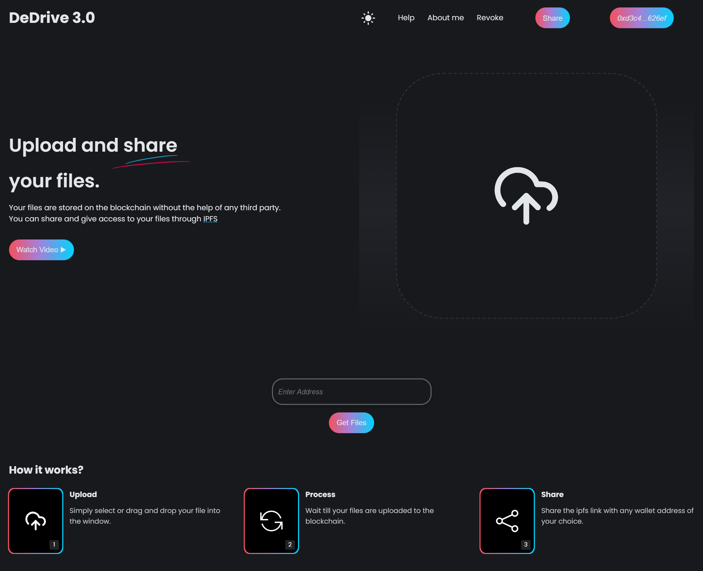

# DeDrive 3.0
DeDrive 3.0 is a decentralized file sharing system, where you can upload, view share and revoke access to your files on the blockchain through [IPFS]("https://ipfs.tech")



**LIVE WEBSITE => [here](https://dedrive-3-0.onrender.com/)** 
## Getting started

### Project Structure
This project consist of 2 directories the, the server(root directory) and the client for our front-end as follows:

- `client/` : contains all the subfolders and files for our react frontend
- `contracts/`: Contains the Solidity smart contract files.
- `scripts/`: Contains JavaScript scripts to deploy and interact with the smart contracts.
- `test/`: Contains test scripts to test the functionality of the smart contracts.
- `hardhat.config.js`: Configuration file for Hardhat setup.
- `index.js`: Node js proxy server file to proxy our request from the client to the endpoint and vice versa
- `README.md`: This file.

 and was developed with ❤️ using the following softwares:

1. React
2. Ethers
3. Node (Express)
4. Solidity
5. Hardhat
6. IPFS

## Requirements

- [git](https://git-scm.com/book/en/v2/Getting-Started-Installing-Git)
  - You'll know you did it right if you can run `git --version` and you see a response like `git version x.x.x`
- [Nodejs](https://nodejs.org/en/)
  - You'll know you've installed nodejs right if you can run:
    - `node --version` and get an ouput like: `vx.x.x`
- [Yarn](https://yarnpkg.com/getting-started/install) instead of `npm`
  - You'll know you've installed yarn right if you can run:
    - `yarn --version` and get an output like: `x.x.x`
    - You might need to [install it with `npm`](https://classic.yarnpkg.com/lang/en/docs/install/) or `corepack`

### Quickstart

```
git clone https://github.com/chidubesteve/DeDrive-3.0.git
cd DeDrive-3.0
yarn
cd client && npm install && npm start
or
npm i
cd client && npm install && npm start
```
 This will spin up our react app in the front end.

# Usage

1. Run your local blockchain with the lottery code

> In a different terminal / command line

```
npx hardhat node
or
yarn hardhat node
```

2. Add hardhat network to your metamask/wallet

- Get the RPC_URL of your hh node (usually `http://127.0.0.1:8545/`)
- Go to your wallet and add a new network. [See instructions here.](https://metamask.zendesk.com/hc/en-us/articles/360043227612-How-to-add-a-custom-network-RPC)
  - Network Name: Hardhat-Localhost
  - New RPC URL: http://127.0.0.1:8545/
  - Chain ID: 31337
  - Currency Symbol: ETH (or GO)
  - Block Explorer URL: None

Ideally, you'd then [import one of the accounts](https://metamask.zendesk.com/hc/en-us/articles/360015489331-How-to-import-an-Account) from hardhat to your wallet/metamask. 


3. you can run the node proxy server in the root directory by
> In a different terminal / command line

 `npm run dev` or `yarn dev`

4. Head over to [Pinata]("https://pinata.cloud")
    (Pinata is an IPFS and farcaster service provider provider)
 to get your api keys . Create a .env file and add them. **NEVER PUSH YOUR KEYS TO  REPO!!**

5. Go to UI and have fun!

Head over to your [localhost](http://localhost:3000) and upload, view and share your files
 
 ### Testing 

 I have written test for the contract in the `test` folder

 - you can run the tests by `npx hardhat test` or a specific test by adding a --grep flag followed by the name of the test eg: `npx hardhat test --grep "it should do this"`

 Feel free to write more test cases 😀😀and you can also change the visibility of state variables in the contract to access the default getter and functions crested by solidity compiler

 ### Deploying

 1. Build your static code.

```
yarn build or npm run build
```

### Contributing
If you you spot a bug in the code, or have a suggestion to improve the code efficiency and wan to contribute to open source, feel free to create a PR!

 ## Thank you!
If you appreciated this, feel free to to ⭐ this repo and follow me

[Twitter]("https://twitter.com/PhoenixWeb3Dev") [LinkedIn]("https://www.linkedin.com/in/chidube-anike-7a7721251/")

(PS: if you want a tutorial on how to build ts from scratch. send me a DM 😉 (If i get enough requests i'll))

Made with ❤ from me!